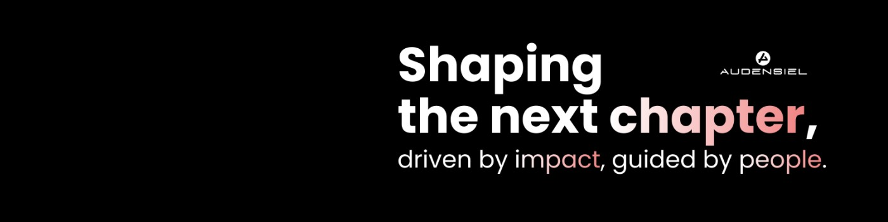

<h1 align="center">🦊 Hi, I am Marwa! 🦊</h1>

  

I'm a bilingual (FR & EN) IT Recruitment Specialist with a strong focus on Capital Markets environments.

Based in Montréal, I support organizations in identifying and attracting high-impact IT professionals across complex and production-driven ecosystems.

While I recruit across various IT domains (Data, Development, Infrastructure, Cloud, Support, QA), I have developed a strong expertise within Capital Markets environments, including Front Office systems, Trading applications, Repo / Securities Finance, Regulatory and Production Support (L2/L3).

What differentiates me is not only my sourcing capability, but my understanding of your business

I work closely with stakeholders to understand:

- trading constraints
- regulatory pressure
- production stability challenges
- and long-term talent retention strategy

I position talent not just as a resource, but as a strategic asset.

Core focus areas:

- Capital Markets IT
- Front Office / Trading Systems
- Data & Regulatory environments
- Production Support
- Full IT lifecycle recruitment

### 📫 Contacts

### 👥 Team Members on GitHub

| Avatar | Name | GitHub Profile | LinkedIn |
| :---: | :--- | :--- | :--- |
|  | **Giorgio Antonelli** | [@GiorgioAntonelli94](https://github.com/GiorgioAntonelli94) | [Profile](https://www.linkedin.com/in/giorgio-antonelli-1b9152245/) |
|  | **Hiba Badra** | [@HibaBadra1004](https://github.com/HibaBadra1004) | [Profile](https://linkedin.com/in/hiba-badra-023480194/) 

## 🌎 About Audensiel 🌎

Audensiel is a global digital transformation partner specializing in high-tech and business consulting across multiple sectors like Banking, Healthcare and Manufacturing. We deliver end-to-end Digital and Cloud/DevOps solutions using Agile methodologies, while leveraging Data, AI, and IoT to build complex interconnected systems. Our expertise extends to robust Cybersecurity auditing and strategic IT governance. We are currently hiring to support our rapid international growth all over the world.

## 🍁 About Audensiel Canada 🍁

Our core areas of expertise help accelerate ambitious digital projects for SMEs and large North American organizations: cybersecurity, agility, user experience, development, and data & AI management.

🚀 We support our clients in achieving their strategic, organizational, and operational goals - from IT consulting and advisory to training their business teams.

🤲 We place our employees and partners at the heart of our priorities by delivering value beyond technical expertise, through a strong eco-responsible commitment and a people-first company culture.

👉 Welcome to our GitHub page! Whether you’re a candidate, client, or simply curious, you’ll get a behind-the-scenes look at our jobs and recruiters' specializations.

### 🚀 Join the Team! Apply now on our websites:

### 🔥 GitHub Streak

## 💼 Open Positions Dashboard

| Status | Role & Stack | Location | Action |
| :--- | :--- | :--- | :--- |
|  | **Python / React Developer**   `Python` • `React` • `Full-stack` | 📍 Montréal (Hybrid) | [**View Job**](https://audensiel.ca/project/developpeur-react-python-f-h-nb-2/) |
|  | **React / .NET Developer**   `React` • `.NET` • `C#` | 📍 Montréal (Hybrid) | [**View Job**](https://audensiel.ca/project/developpeur-react-net-f-h-nb/) |
|  | **Data Engineer**   `Databricks` • `Big Data` • `Azure/AWS` | 📍 Montréal (Hybrid) | [**View Job**](https://audensiel.ca/project/data-engineer/) |

---
